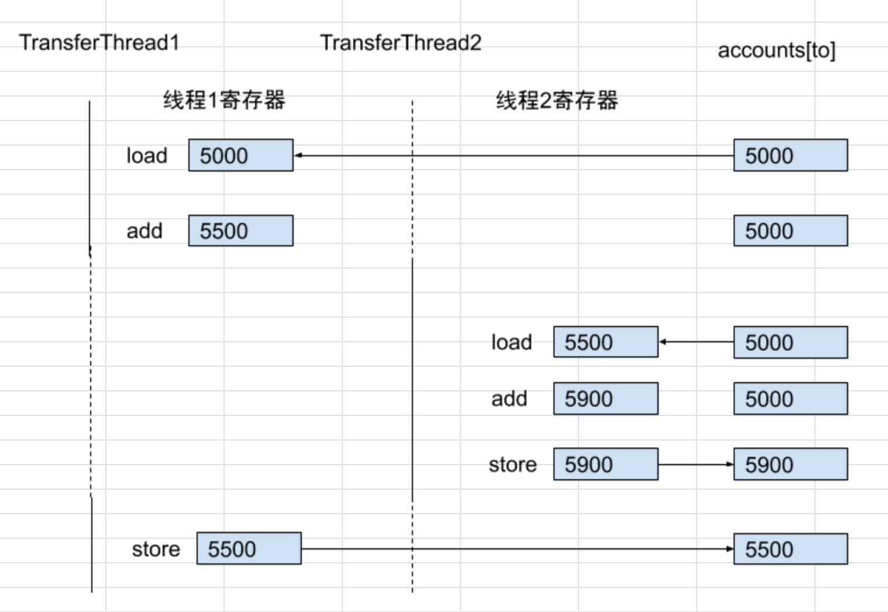

# 并发

多线程程序在更低一层扩展了多任务的概念：单个程序看起来在同时完成多个任务。每个任务在一个线程（thread）中执行，线程是控制线程的简称。如果一个程序可以同时运行多个线程，则称这个程序是*多线程的*

*多进程与多线程有哪些区别？*

本质的区别在于每个进程都拥有自己的一整套变量，而线程则共享数据。
共享变量使线程之间的通信比进程之间的通信更有效、更容易。
与进程相比，线程更“轻量级”，创建、撤销一个线程比启动新进程的开销要小得多。

## 线程状态

线程有6种状态：

* New(新建)
* Runnable (可运行)
* Blocked (阻塞)
* Waiting (等待)
* Timed waiting (记时等待)
* Terminated (终止)

确定线程的当前状态。只需要调用`getState`

> `static void yield()` 使当前正在执行的线程向另一个线程交出运行权。

## 线程属性

中断的状态、守护进程、未捕获异常的处理器以及不应使用的一些遗留特性。

### 中断线程

当对一个线程调用`interrupt`方法时，就会设置线程的中断状态。这是每个线程都有的boolean标志。每个线程都应该不时地检查这个标志，以判断线程是否被中断。

想要得出是否设置了中断状态。

```
while (!Thread.currentThread().isInterrupted() && more work to do) {
    do more work;
}
```

如果线程被阻塞，就无法检查中断状态。当在一个被`sleep`或`wait`调用阻塞的线程上调用`interrupt`方法时，那个阻塞调用将被`InterruptedException`异常中断。

如果在每次工作迭代之后都调用`sleep`(或其他可中断方法)，`isInterrupted`检查既没有必要也灭有用处。如果设置了中断状态，此时倘若调用`sleep`，它不会休眠。实际上，它会清除中断状态并抛出`InterruptedException`。因此，如果你的循环调用了`sleep`,不要检测中断状态，而应该捕获`InterruptedException`异常。

```
Runnable r = () -> {
    try {
        while (more work to do) {
            do work;
            Thread.sleep(delay);
        }
    } catch (InterruptedException e) {
        // Thread was interrupted during sleep
    } finally {
        clearup if required
    }
};
```

处理`InterruptedException`，有两种方式：

*在catch子句中调用interrupted()来设置中断状态*

```
void mySubTask() {
    try { sleep(delay); }
    catch (InterruptedException e) { Thread.currentThread().interrupted(); }
}
```

*更好的选择，用`throws InterruptedException`标记你的方法， 去掉try语句块*

```
void mySubTask() throws InterruptedException {
    ...
    sleep(delay);
    ...
}
```

### 守护进程

可以通过`t.setDaemon(true)`将一个线程转换为*守护线程（daemon thread）*

*守护线程*的唯一用途是为其他线程提供服务。

### 线程名

```
var t = new Thread(runnable);
t.setName("web crawler");
```

### 未捕获异常的处理器

线程run方法不能抛出任何检查型异常，但是，非检查型异常可能会导致线程停止。这种情况下，线程会死亡。

实际上，在线程死亡之前，异常会传递到一个用于处理未捕获异常的处理器。

这个处理器必须属于一个实现了`Thread.UncaughtExceptionHandler`接口的类。

可以使用`Thread`类的静态方法`setDefaultUncaughtExceptionHandler`为所有线程安装一个默认的处理器。替换处理器可以使用日志`API`将未捕获异常的报告发送到一个日志文件。

### 线程优先级

可以使用`setPriority`提高或降低任何一个线程的优先级。

## 同步

如果两个线程存取同一个对象，并且每个线程分别调用一个修改该对象状态的方法。这两个线程会相互覆盖。取决于线程访问数据的次序，可能会导致对象被破坏。这种情况通常称为*竟态条件(race condition)*

详见：`unsynch/UnsynchBankTest.java`

上面程序其中几个线程会更新银行账户余额。运行一段时间后，有钱丢失导致余额不正确。

假设两个线程同时执行指令：`accounts[to] += amount;`

问题在于这不是原子操作：

1、将`accounts[to]`加载到寄存器
2、增加`amount`
3、将结果写回`accounts[to]`

*现在，假设第1个线程执行步骤1和2，然后，它的运行权被抢占。再假设第2个线程被唤醒，更新account数组中的同一个元素。然后，第1个线程被唤醒并完成其第3步*




### 锁对象 (ReentrantLock)

有两种机制可以防止并发访问代码块。

* `ReentrantLock`类
* `synchronized`关键词会自动提供一个锁以及相关的“条件”，对于大多数需要显示锁的情况，这种机制功能很强大，也很便利。

> 要把unlock操作包括在finally子句中，这一点至关重要。使用琐时，不能使用try-with-resources语句。

```
public class Bank {
    private var bankLock = new ReentrantLock();

    public void transfer(int from, int to, int amount) {
        bankLock.lock();
        try {
            System.out.print(Thread.currentThread());
            accounts[from] -= amount;
            System.out.printf(" %10.2f from %d to %d", amount, from, to);
            accounts[to] += amount;
            System.out.printf(" Total Balance: %10.2f%n", getTotalBalance());
        } finally {
            bankLock.unlock();
        }
    }
}
```

假设一个线程调用了`transfer`，但是在执行结束前被抢占。再假设第二个线程也调用了`transfer`。由于第二个线程不能获得锁，将在调用`lock`方法时被阻塞。它会暂停，必须等待第一个线程执行完`transfer`方法。当第一个线程释放锁时，第二个线程才能开始运行。

### 条件对象 (newCondition)

线程进入临界区后却发现只有满足某个条件之后它才能执行。可以使用一个条件对象来管理那些已经获得了一个锁却不能做有用工作的线程。条件对象经常被称为*条件变量*

在线程再次运行前，账户余额可能已经低于提款金额。必须确保在检查余额与转账活动之间没有其他线程修改余额。可以使用一个锁来保护这个转账操作。

```
public void transfer(int from, int to, int amount) {
    bankLock.lock();
    try {
        while (accounts[from] < amount) {
            // wait
        }
    } finally {
        bankLock.unlock();
    }
}
```

当帐户没钱时，我们要等待，直到另一个线程向账户中增加了资金。但是，这个线程刚刚获得了对bankLock的排他性访问权，因此别的线程没有机会，这里需要引入条件对象。

一个锁对象可以有一个或多个相关联的条件对象。

```
class Bank {
    private Condition sufficientFunds;
    
    public Bank() {
        sufficientFunds = bankLock.newCondition();
    }
}
```

如果transfer资金不足，它会调用`sufficientFunds.await()`，当前线程现在暂停，并放弃锁。

等待获得锁的线程和已经调用了`await`方法的线程存在本质上的不同。一旦一个线程调用了`await`方法，它就进入这个条件的等待集。当锁可用时，该线程并不会变为可运行状态。实际上，它仍保持非活动状态，直到另一个线程在同一条件上调用`signalAll`方法。

当另一个线程完成转账时`sufficientFunds.signalAll()`。

这个调用会重新激活等待这个条件的所有线程。当这些线程从等待集中移出时，它们再次成为可运行的线程，调度器最终将再次将它们激活。同时，它们会尝试重新进入该对象。一旦锁可用，它们中某个线程将从`await`调用返回，得到这个锁，并从之前暂停的地方继续执行。

此时，线程应当再次测试条件。不能保证现在一定满足条件--signalAll方法仅仅是通知等待的线程：现在有可能满足条件，值得再次检查条件。

```
public void transfer(int from, int to, int amount) {
    bankLock.lock();

    try{
        while (accounts[from] < amount)
            sufficientFunds.await();
        ...
        sufficientFunds.signalAll();
    } finally{
        bankLock.unlock();
    }
}
```

> signalAll调用不会立即激活一个等待的线程。它只是解除等待线程的阻塞，使这些线程可以在当前线程释放锁之后竞争访问对象。

### synchronized 关键词

如果一个方法声明了`synchronized`关键词，那么对象的锁将保护整个方法。也就是说，要调用这个方法，线程必须获得*内部对象锁*。

同步方法
```
public synchronized void method() {
    method body
}
```
等价于

```
public void method() {
    this.intrinsicLock.lock();
    try {
        method body
    } finally {
        this.intrinsicLock.unlock();
    }
}
```

所以，可以简单地将`Bank`类的`transfer`方法声明为`synchronized`,而不必使用一个显式的锁;

```
class Bank {
    public synchronized void transfer(int from, int to, int amount) throws InterruptedException {
        while (accounts[from] < amount)
            wait(); // 等价于 this.intrinsicLock.await() 
        accounts[from] -= amount;
        accounts[to] += amount;
        notifyAll(); // 等价于 this.intrinsicLock.signalAll()
    }
}
```

### 同步块

每一个Java对象都有一个锁。线程可以通过调用同步方法获得锁。还有另一种机制可以获得锁：即进入一个同步块。当线程进入如下形式的块时：

```
synchronized (obj) { // this is the syntax for a synchronized block
    critical section
}
```

### 监视器

监视器的特性：

* 监视器只是包含私有字段的类
* 监视器类的每个对象有一个关联的锁。
* 所有方法由这个锁锁定。换句话说，如果客户端调用`obj.method()`,那么`obj`对象的锁在方法调用开始时自动获取，并且当方法返回时自动释放该锁。因为所有的字段是私有的，这样的安排可以确保一个线程处理字段时，没有其他线程能够访问这些字段。
* 锁可以有任意多个相关联的条件。

Java设计者以不太严格的方式采用了监视器概念，Java中的每一个对象都有一个内部锁和一个内部条件。如果一个方法用`synchronized`关键词声明，那么，它表现得就像是一个监视器方法。可以通过调用`wait/notifyAll/notify`来访问条件变量。

### volatile 字段

Brian Goetz 创造了“同步格言”： “如果写一个变量，而这个变量接下来可能会被另一个线程读取，或者，如果读一个变量，而这个变量可能已经被另一个线程写入值，那么必须使用同步。”

`volatile`关键词为实例字段的同步访问提供了一种免锁机制。如果声明了一个字段为`volatile`,那么编译器和虚拟机就知道该字段可能被另一个线程并发更新。

```
private boolean done;
public synchronized boolean isDone() { return done; }
public synchronized void setDone() { done = true; }
```

这种情况下，将字段声明为`volatile`就很合适：

```
private volatile boolean done;
public boolean isDone() { return done; }
public void setDone() { done = true; }
```

### 原子性

### 死锁

有可能因为每一个线程要等待更多的钱款存入而导致所有线程都被阻塞。这种状态称为*死锁*。

## 线程安全的集合

可以通过提供锁来保护共享的数据结构，但是选择线程安全的实现可能更为容易。

### 阻塞队列

使用队列，可以安全地从一个线程向另一个线程传递数据。

### 同步包装器

任何集合类都可以通过使用同步包装类(synchronization wrapper)变成线程安全：

```
List<E> synchArrayList = Collections.synchronizedList(new ArrayList<E>());
Map<K, V> synchHashMap = Collections.synchronizedMap(new HashMap<K, V>());
```

## 任务和线程池

构造一个新的线程开销有些大，如果程序中创建了大量的生命期很短的线程，应该使用线程池（thread pool）。线程池中包含许多准备运行的线程。为线程池提供一个`Runnable`，就会有一个线程调用`run`方法。当`run`退出时，这个线程不会死亡，而是留在池中为下一个请求提供服务。

### Callable 与 Futrue

`Callable`接口是一个参数化的类型。参数类型是返回值的类型。`Callable<Integer>`表示一个最终返回`Integer`对象的异步计算。

`Future`保存异步计算结果。

执行`Callable`的一种方法是使用`FutureTask`,它实现了`Future`和`Runnable`接口：


```
Callable<Integer> task = ..
var futureTask = new FutureTask<Integer>(task);
var t = new Thread(futureTask);

t.start();
Integer result = task.get();
```

### 执行器

执行器(`Executors`)类有许多静态工厂方法，用来构造线程池。

| 方法                                |         描述                             |
|------------------------------------|----------------------------------------- |
| newCachedThreadPool                |  必要时创建新线程；空闲线程会保留60秒；        |
| newFixedThreadPool                 |  池中包含固定数目的线程；空闲线程会一直保留     |
| newWorkStealingPool                |  适合“fork-join”任务                      |
| newSingleThreadExecutor            |  只有一个线程的“池”，会顺序地执行所提交的任务   |
| newScheduledThreadPool             |  用于调度执行的固定线程池                    |
| newSingleThreadScheduledExecutor   |  用于调度执行的单线程“池”                    |  

使用线程池所做的工作：

1、 调用`Executors`类的静态方法`newCachedThreadPool`或`newFixedThreadPool`
2、 调用`submit`提交`Runnable`或`Callable`对象
3、 保存好返回的`Future`对象，以便得到结果或者取消任务。
4、 当不想再提交任何任务时，调用`shutdown`

### 控制任务组

`invokeAny`方法提交一个`Callable`对象集合中的所有对象。并返回某个已完成任务的结果。往往最快完成的任务。

`invokeAll`方法提交一个`Callable`对象集合中的所有对象，这个方法会阻塞，直到所有任务完成，并返回表示所有任务答案的一个`Future`对象列表。

```
List<Callable<T>> tasks = ...
List<Future<T>> results = executor.invokeAll(tasks);
for (Future<T> result : results)
    processFurther(result.get());
```

for 循环中的， 第一个`result.get()`调用会阻塞，直到第一个结果可用。如果所有任务几乎同时完成，这不会有问题。

利用`ExecutorCompletionService`来管理, 通常的方式得到一个执行器。然后构造一个`ExecutorCompletionService`。将任务提交到这个完成服务。该服务会管理`Future`对象的一个阻塞队列，其中包含所提交任务的结果。（一旦结果可用，就加入队列）。因此要完成之前的计算，下面更高效：

```
var service = new ExecutorCompletionService<T>(executor);
for (Callable<T> task : tasks) service.submit(task);
for (int i = 0; i < tasks.length; i++)
    processFurther(service.take().get());
```

### fork-join框架

`fork-join` 适用于一些应用可能对每一个处理器内核分别使用一个线程，以完成计算密集型任务，如图像或视频处理。

要采用框架可用的一种方式完成这种递归计算，需要提供一个扩展`RecursiveTask<T>`的类或者提供了扩展`RecursiveAction`的类（不生成任何结果）。再覆盖`compute`方法来生成并调用子任务，然后合并其结果。

```
class Counter extends RecursiveTask<Integer>
{
    protected Integer compute() {
        if (to - form < THRESHOLD) {
            solve
        } else {
            int mid = (from + to) / 2;
            var first = new Counter(values, from, mid, filter);
            var second = new Counter(values, mid, to, filter);
            invokeAll(first, second); // 接收到很多任务并阻塞
            return first.join() + second.join(); // join生成结果。对每个子任务应用join，并返回其总和。
        }
    }
}
```

## 进程

有时还需要执行另一个程序。为此，使用`ProcessBuilder`和`Process`类。
